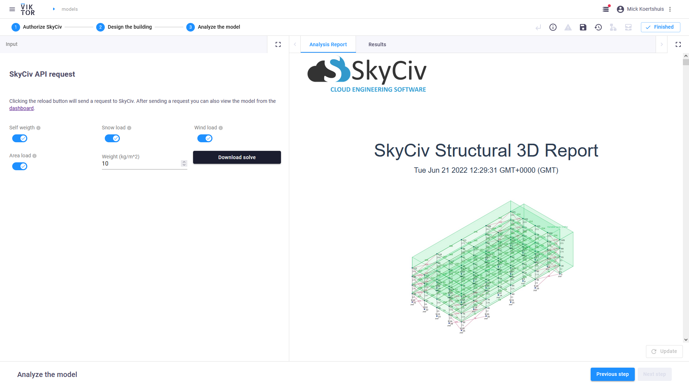

# SkyCiv integration
This sample app shows how to use the SkyCiv API with VIKTOR 

This app will show you how to build a basic structure with VIKTOR parameters and then lets you solve the model with the use of SkyCiv. To use the solving functionality of SkyCiv you need to have an API key. However, you can try out the app in the [VIKTOR demo environment](https://demo.viktor.ai/workspaces/35/app/dashboard) for free. Moreover [authorization](#authorization) later.

## SkyCiv's cloud engineering in 2 steps

**Defining the building**
First you can design your building with the use of VIKTOR. We will use the [SkyCiv Pip Package](https://pypi.org/project/skyciv/) to build a model and send it to the [SkyCiv renderer](https://skyciv.com/api/v3/docs/s3d-renderer-core/) that we have imported.

Here you can also change the building properties. For this example we have the following properties: length, width, number of floors, the spacing between the columns, the materials and if we would like to add braces or not.

It is also possible to select coordinates for your project on the MapView. These coordinates can be used with other SkyCiv tools. For this sample app we only use this to get the snow load during the analyze step.

**Analysing your design**
In the analyze step you can select which loads you want to add to the model. If you have selected the desired loads you can hit reload and send an API request to SkyCiv to solve your model. This will use some of your API credits. Also note that the more nodes, members and loads you add to the model the longer the calculation will take.

SkyCiv can create a webpage with the complete analysis report that we can easily show with our WebView.

The deformations are shown in the Results tab.

By default, this example application also saves the model you have made in the SkyCiv cloud and it is accessible via your [dashboard](https://platform.skyciv.com/dashboard) on your skyciv profile.

## Authorization

The app running in the demo environment uses the environment variable `VIKTOR_APP_SECRET` for authorization. This variable is set when [publishing](https://docs.viktor.ai/docs/cli#publish) the app. If you want to run the app locally you need to add your own username and key to the `ApiObject`. The API key can be found on the "API Access" page on your [SkyCiv profile](https://platform.skyciv.com/account/api). You can then run the app using `viktor-cli start --env VIKTOR_APP_SECRET="<username>;<API KEY>"`. This will also enable you to interact with the model inside your [dashboard](https://platform.skyciv.com/dashboard) as shown [earlier](#analysing-your-design).